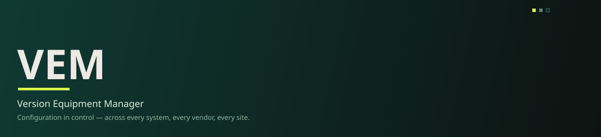

 

# Version Equipment Manager Components

## What is this org?
This organization hosts the vendor and hardware integration components used by the VEM platform - the individual building blocks that connect PLCs, vision systems, robotics, HMIs, and other line equipment into a single automation layer.

## How it relates to VEM
VEM is a configuration & version-control platform for continuously validated production. These component repos are the integration layer beneath it, each one built and maintained independently to support a specific vendor or device type.
